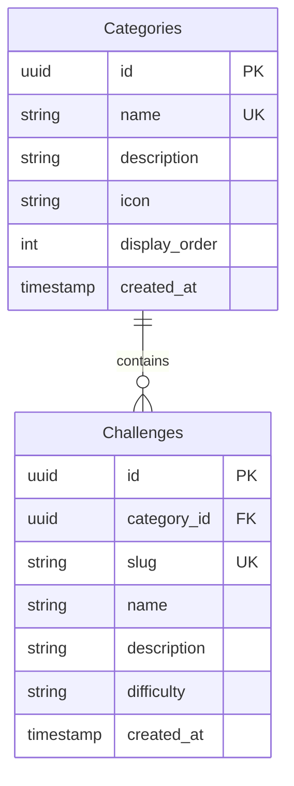

# 数据库架构与 Docker 配置规格

## 为什么需要

当前项目是一个 AI 时代前端开发者技能挑战平台，挑战数据目前以硬编码方式存储在代码中。这种方式存在以下问题：

1. 数据无法持久化存储
2. 难以管理和更新挑战内容
3. 无法支持用户进度跟踪等扩展功能

通过引入 PostgreSQL 数据库和 Drizzle ORM，可以实现挑战内容的持久化存储，同时保持类型安全和高性能。

## 变更内容

* 设计 PostgreSQL 数据库架构，包含挑战、分类、难度等级等核心表

* 创建 Docker Compose 配置，设置 PostgreSQL 数据库容器

* 集成 Drizzle ORM，配置数据库连接和 schema 定义

* **BREAKING**: 新增环境变量配置要求

## 影响范围

* **受影响的规格**: 挑战展示功能、多语言支持

* **受影响的代码**:

  * `src/app/[locale]/challenge/page.tsx` - 需从数据库读取挑战

  * `src/app/[locale]/challenge/[slug]/page.tsx` - 需从数据库读取挑战详情

  * 新增 `src/server/lib/db/` - 数据库相关代码

## 新增需求

### Requirement: 数据库架构

系统 SHALL 提供 PostgreSQL 数据库架构，包含以下核心表：

#### 场景: 数据库表结构

* **GIVEN** 开发者配置了数据库连接

* **WHEN** 数据库迁移执行

* **THEN** 创建以下表：

  * `categories` - 挑战分类

  * `challenges` - 挑战详情

  * `difficulty_levels` - 难度等级

### Requirement: Docker 配置

系统 SHALL 提供 Docker Compose 配置，用于启动 PostgreSQL 数据库：

#### 场景: 启动数据库容器

* **GIVEN** 用户已安装 Docker

* **WHEN** 执行 `docker-compose up -d`

* **THEN** PostgreSQL 容器成功启动，可通过 `localhost:5432` 访问

### Requirement: Drizzle ORM 集成

系统 SHALL 提供 Drizzle ORM 配置和 schema 定义：

#### 场景: 数据库查询

* **GIVEN** Drizzle ORM 已配置

* **WHEN** 应用启动时

* **THEN** 可以通过类型安全的 API 查询数据库

## 修改需求

### Requirement: 挑战数据获取

现有的挑战数据硬编码需迁移到数据库：

**修改内容**: 将 `src/app/[locale]/challenge/page.tsx` 中的 `categories` 数组数据迁移到数据库

**迁移策略**: 创建 seed 脚本，将现有挑战数据导入数据库

## 删除需求

无

## 数据库架构设计

### ERD 图



### 表结构说明

#### categories 表

| 字段             | 类型           | 约束                              | 说明     |
| -------------- | ------------ | ------------------------------- | ------ |
| id             | UUID         | PK, DEFAULT gen\_random\_uuid() | 分类ID   |
| name           | VARCHAR(100) | UNIQUE, NOT NULL                | 分类名称   |
| description    | TEXT         | <br />                          | 分类描述   |
| icon           | VARCHAR(50)  | NOT NULL                        | 分类图标标识 |
| display\_order | INTEGER      | DEFAULT 0                       | 显示顺序   |
| created\_at    | TIMESTAMP    | DEFAULT NOW()                   | 创建时间   |

#### challenges 表

| 字段           | 类型           | 约束                              | 说明      |
| ------------ | ------------ | ------------------------------- | ------- |
| id           | UUID         | PK, DEFAULT gen\_random\_uuid() | 挑战ID    |
| category\_id | UUID         | FK, NOT NULL                    | 所属分类    |
| slug         | VARCHAR(100) | UNIQUE, NOT NULL                | URL友好标识 |
| name         | VARCHAR(255) | NOT NULL                        | 挑战名称    |
| description  | TEXT         | <br />                          | 挑战描述    |
| difficulty   | VARCHAR(20)  | NOT NULL                        | 难度等级    |
| created\_at  | TIMESTAMP    | DEFAULT NOW()                   | 创建时间    |

#### 索引设计

* `categories`: name (UNIQUE), display\_order

* `challenges`: category\_id, slug, difficulty

## Docker 配置

### docker-compose.yml

* PostgreSQL 15

* 端口: 5432

* 数据库名: api\_test

* 用户名: api\_user

* 密码: 从环境变量读取

## Drizzle ORM 配置

### 文件结构

```
src/server/lib/db/
├── schema.ts          # 表定义
├── index.ts           # 数据库连接
├── migrations/       # 迁移文件
└── seeds/            # 种子数据
```

### 配置要求

* 使用 `drizzle-orm` 和 `postgres-js`

* 支持 bun 运行时

* 环境变量: `DATABASE_URL`

